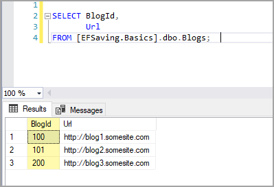

# About

This code sample demonstrates how to control setting a record primary key using SET IDENTITY_INSERT O/OFF

Code is in ValueGenerationLibrary class project. Here we leave the assembly name as is but change the default namespace to this console project SqlServer.ValueGeneration. Not many developers know about this, it came come in handy when dealing with unit test. Since the default namespace matches this console project no additional using statements are required as shown below.

```csharp
namespace SqlServer.ValueGeneration
{
    class Program
    {
        static void Main(string[] args)
        {
            ExplicitIdentityValues.Run();
        }
    }
}
```

</br>

