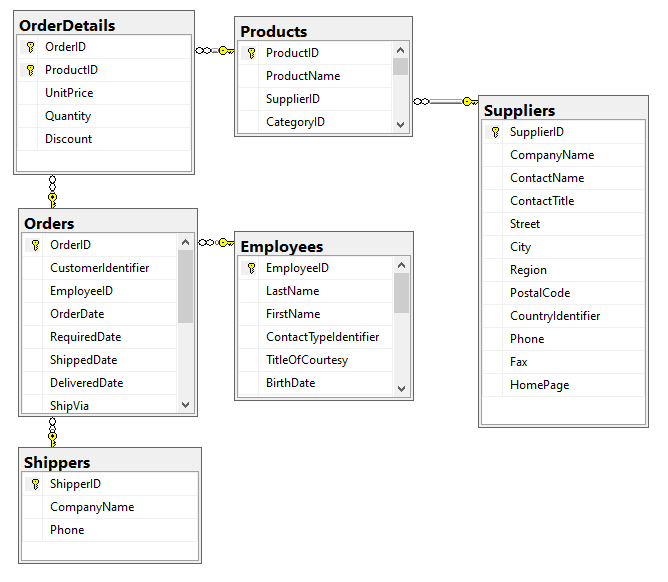
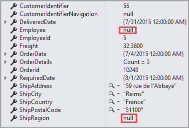
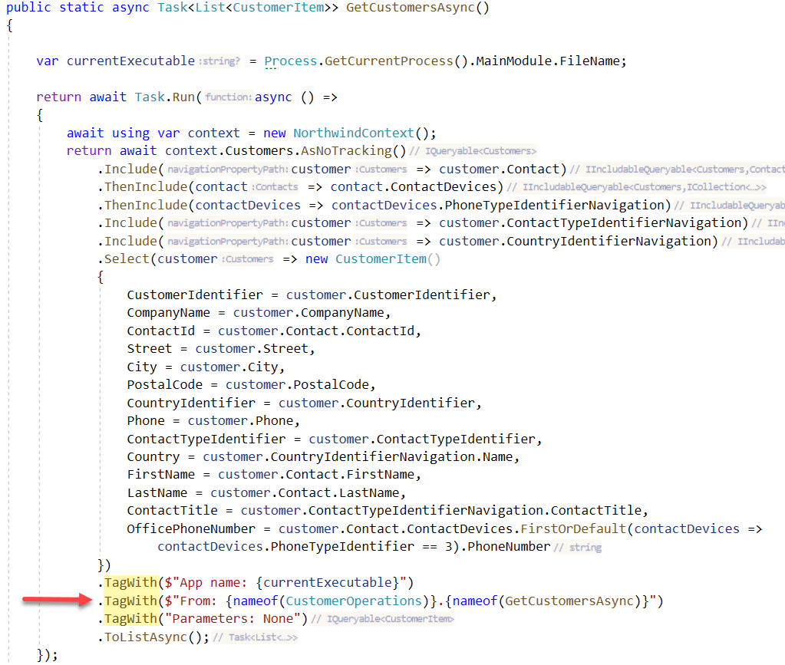

This repository is for getting started with Entity Framework Core[^1] basics and some intermediate and advance topics.

When working with EF Core, there are several avenues to start.

- Writing code to configure a database, tables and relationships. Once code is written a developer uses migrations[^2] to create and optionally populate the database.
- Reverse Engineering[^3] a database which is the process of scaffolding entity type classes and a DbContext class based on a database schema.

## Loading data

- [Eager](https://docs.microsoft.com/en-us/ef/core/querying/related-data/eager) loading means that the related data is loaded from the database as part of the initial query.
  - Entity Framework Core will automatically fix-up navigation properties to any other entities that were previously loaded into the context instance. So even if you don't explicitly include the data for a navigation property, the property may still be populated if some or all of the related entities were previously loaded.
- [Explicit](https://docs.microsoft.com/en-us/ef/core/querying/related-data/explicit) loading means that the related data is explicitly loaded from the database at a later time.
- [Lazy](https://docs.microsoft.com/en-us/ef/core/querying/related-data/lazy) loading means that the related data is transparently loaded from the database when the navigation property is accessed.
  - Friends don't let friends use lazy loading

In the code samples within this repository `eager` loading is used.


# Local NuGet feeds


# Sample query statements

The following is the model for queries to follow.

Two missing, Customers and Categories.



**Get first details for specific order**

Here only the order and the first detail is read back. Note `Include` performs egar loading of the order.

```csharp
int orderId = 10248;
using var context = new NorthwindContext();

OrderDetails details = context.OrderDetails
    .Include(ord => ord.Order)
    .FirstOrDefault(ord => ord.OrderId == orderId);
```

**Get first detail, `employee`, `customer` and `Shipping`**

```csharp
Orders order = context.Orders
    .Include(ord => ord.Employee)
    .Include(ord => ord.CustomerIdentifierNavigation)
    .Include(ord => ord.ShipViaNavigation)
    .FirstOrDefault(ord => ord.OrderId == orderId);
```

**List of all order details with different joins**

```csharp
List<OrderDetails> details = context.OrderDetails
    .Include(ordd => ordd.Product)
    .Include(ordd => ordd.Product.Category)
    .Include(ordd => ordd.Product.Supplier)
    .Where(ord => ord.OrderId == order.OrderId).ToList();
```


```csharp
public static async Task<Orders> GetOrder(int orderId = 10248)
{
    await using var context = new NorthwindContext();

    return await context
        .Orders
        .Include(ord => ord.OrderDetails)
        .ThenInclude(ord => ord.Product)
        .Where(ord => ord.OrderId == orderId)
        .FirstOrDefaultAsync();
}
```

Results,several tables are not included.




Anything can be included or excluded as needed and what makes sense.

# Entity Framework Core shadow properties

[Shadow properties](https://docs.microsoft.com/en-us/ef/core/modeling/shadow-properties) are properties that are not defined in your .NET entity class but are defined for that entity type in the EF Core model. The value and state of these properties is maintained purely in the Change Tracker. Shadow properties are useful when there is data in the database that should not be exposed on the mapped entity types. Code samples presented will provided simple, useful examples for using shadow properties using a class project for Entity Framework Core code logic with a Windows form project to present data from a SQL-Server database

# Query tags

[Query tags](https://docs.microsoft.com/en-us/ef/core/querying/tags) help correlate LINQ queries in code with generated SQL queries captured in logs.  Information in `TagWith` are available in SQL-Server profiler, unsure about Oracle tools.



# Tracking Queries

[Tracking](https://docs.microsoft.com/en-us/ef/core/querying/tracking) behavior controls if Entity Framework Core will keep information about an entity instance in its change tracker. If an entity is tracked, any changes detected in the entity will be persisted to the database during SaveChanges(). EF Core will also fix up navigation properties between the entities in a tracking query result and the entities that are in the change tracker.

For example, if `Contacts` are used for display only [AsNoTracking](https://docs.microsoft.com/en-us/dotnet/api/system.data.entity.dbextensions.asnotracking?view=entity-framework-5.0.0) would be used which means any changes are not tracked.

```csharp
public static async Task<List<Contacts>> ByType(List<int> identifiers)
{
    return await Task.Run(async () =>
    {
        await using var context = new NorthwindContext();
        return await context.Contacts.AsNoTracking()
            .Where(currentContact =>
                currentContact.ContactTypeIdentifier.HasValue &&
                identifiers.Contains(currentContact.ContactTypeIdentifier ?? 0))
            .ToListAsync();

    });
}
```

</br>

> Now in most cases no tracking will be used as there usually is a disconnect between a read and save operation in which case mark the changed entity state and save back to a new DbContext.

Example for examining current and original values

```csharp
public static List<ChangeContainer> ShowEventsChangesPlain()
{

    List<ChangeContainer> changedList = new();

    /*
     * Note that Person is alias for Person1 done in the DbContext
     */
    foreach (Person currentPerson in Context.Person.Local)
    {
        if (Context.Entry(currentPerson).State != EntityState.Unchanged)
        {
            ChangeContainer item = new ()
            {

                Id = currentPerson.Id,

                CurrentFirstName = currentPerson.FirstName,
                OriginalFirstName = Context.Entry(currentPerson).Property(person => person.FirstName).OriginalValue,

                CurrentLastName = currentPerson.LastName,
                OriginalLastName = Context.Entry(currentPerson).Property(person => person.LastName).OriginalValue,

                CurrentBirthDate = currentPerson.BirthDate,
                OriginalBirthDate = Context.Entry(currentPerson).Property(person => person.BirthDate).OriginalValue,

                EntityState = Context.Entry(currentPerson).State
            };

            changedList.Add(item);
        }
    }

    return changedList;

}
```

Another option is to use ChangeTracker.DebugView.[LongView](https://docs.microsoft.com/en-us/ef/core/change-tracking/debug-views#the-long-view) or ChangeTracker.DebugView.[ShortView](https://docs.microsoft.com/en-us/ef/core/change-tracking/debug-views#the-short-view)

The nice thing with a little thinking is to wrap LongView into a language extensions to control what is returned when there are many entities being tracked.

Karen's extensions

```csharp
/// <summary>
/// Extension methods for assisting in both learning EF Core and debugging.
/// </summary>
/// <remarks>
/// See also  https://docs.microsoft.com/en-us/ef/core/change-tracking/debug-views
/// Note that future releases of EF Core may break these methods but should be easy to tweak.
/// </remarks>
public static class DebugViewExtensions
{
    /// <summary>
    /// Filter LongView
    /// </summary>
    /// <param name="sender"></param>
    /// <param name="tokens">Filter token array</param>
    /// <param name="chunkSize"></param>
    /// <returns>filtered view</returns>
    public static string CustomViewByChunks(this DebugView sender, string[] tokens, int chunkSize)
    {
        var longViewLinesList = sender
            .LongView.Split(new[] { Environment.NewLine }, StringSplitOptions.None)
            .ToList();

        /*
         * Split LongView into chunks
         */
        var chunks = longViewLinesList.ChunkBy(chunkSize);

        StringBuilder builder = new();

        /*
         * Incrementally find items in tokens array
         */
        foreach (var chunk in chunks)
        {
            foreach (var item in chunk)
            {
                if (item.Has(tokens))
                {
                    builder.AppendLine(item);
                }
            }
        }

        return builder.ToString();

    }

    /// <summary>
    /// Variation of the above
    /// </summary>
    /// <param name="sender"></param>
    /// <param name="tokens"></param>
    /// <param name="lineCount"></param>
    /// <returns></returns>
    public static string CustomView(this DebugView sender, string[] tokens, int? lineCount)
    {
        var longViewLines = sender
            .LongView.Split(new[] { Environment.NewLine }, StringSplitOptions.None);

        StringBuilder builder = new();
        if (lineCount.HasValue)
        {
            var result = longViewLines
                .Where(item => item.Has(tokens))
                .Take(lineCount.Value)
                .ToArray();

            foreach (var line in result)
            {
                builder.AppendLine(line.Contains("Unchanged", StringComparison.OrdinalIgnoreCase) ?
                    "" :
                    line.TrimStart());
            }
        }

        return builder.ToString();

    }
}
```


[^1]: [Entity Framework Core](https://docs.microsoft.com/en-us/ef/core/) 
Entity Framework (EF) Core is a lightweight, extensible, open source and cross-platform version of the popular Entity Framework data access technology.

[^2]: [Migrations](https://docs.microsoft.com/en-us/ef/core/managing-schemas/migrations/?tabs=dotnet-core-cli) Overview In real world projects, data models change as features get implemented: new entities or properties are added and removed, and database schemas need to be changed accordingly to be kept in sync with the application. The migrations feature in EF Core provides a way to incrementally update the database schema to keep it in sync with the application's data model while preserving existing data in the database.

[^3]: Reverse Engineering an existing database with Microsoft command line tools or a Visual Studio extension like [EF Power Tools](https://marketplace.visualstudio.com/items?itemName=ErikEJ.EFCorePowerTools). There are other tools to reverse engineer databases, some a paid for and others which are free require knowledge of [T4 templates](https://docs.microsoft.com/en-us/visualstudio/modeling/code-generation-and-t4-text-templates?view=vs-2022).